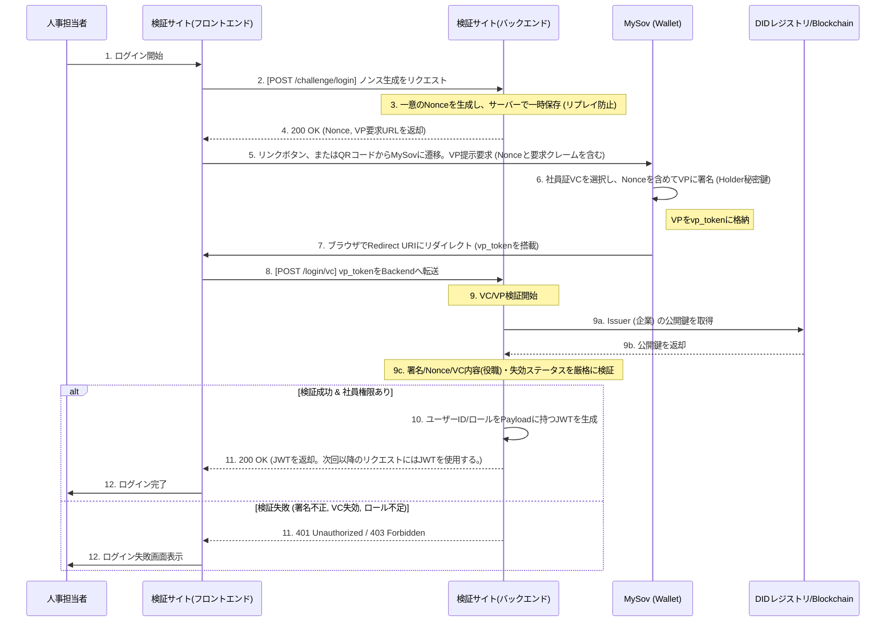
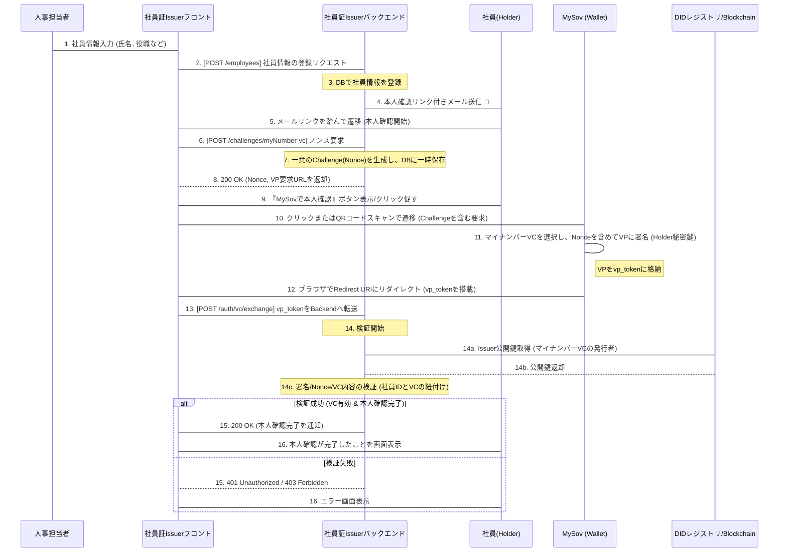
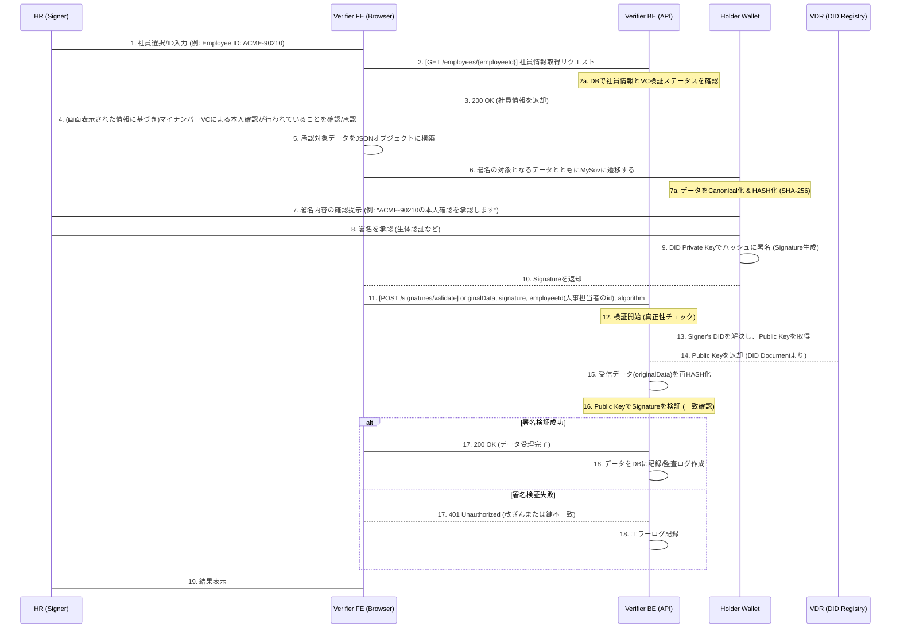

## 人事担当者のVCによるログインとJWT作成フローについて

```mermaid
sequenceDiagram
    participant HR as 人事担当者
    participant IssuerFE as 検証サイト(フロントエンド)
    participant IssuerBE as 検証サイト(バックエンド)
    participant MySov as MySov (Wallet)
    participant VDR as DIDレジストリ/Blockchain

    HR->>IssuerFE: 1. ログイン開始
    
    %% VC検証要求 (Challenge Generation)
    IssuerFE->>IssuerBE: 2. [POST /challenge/login] ノンス生成をリクエスト
    Note over IssuerBE: 3. 一意のNonceを生成し、サーバーで一時保存 (リプレイ防止)
    IssuerBE-->>IssuerFE: 4. 200 OK (Nonce, VP要求URLを返却)
    IssuerFE->>MySov: 5. リンクボタン、またはQRコードからMySovに遷移。VP提示要求 (Nonceと要求クレームを含む)

    %% 署名と提示 (VP Presentation)
    MySov->>MySov: 6. 社員証VCを選択し、Nonceを含めてVPに署名 (Holder秘密鍵)
    Note right of MySov: VPをvp_tokenに格納
    MySov->>IssuerFE: 7. ブラウザでRedirect URIにリダイレクト (vp_tokenを搭載)
    IssuerFE->>IssuerBE: 8. [POST /login/vc] vp_tokenをBackendへ転送

    %% 検証とセッション確立 (Verification & Session Grant)
    Note over IssuerBE: 9. VC/VP検証開始
    IssuerBE->>VDR: 9a.  Issuer (企業) の公開鍵を取得
    VDR-->>IssuerBE: 9b. 公開鍵を返却
    Note over IssuerBE: 9c. 署名/Nonce/VC内容(役職)・失効ステータスを厳格に検証

    alt 検証成功 & 社員権限あり
        IssuerBE->>IssuerBE: 10. ユーザーID/ロールをPayloadに持つJWTを生成
        IssuerBE-->>IssuerFE: 11. 200 OK (JWTを返却。次回以降のリクエストにはJWTを使用する。)
        IssuerFE->>HR: 12. ログイン完了
    else 検証失敗 (署名不正, VC失効, ロール不足)
        IssuerBE-->>IssuerFE: 11. 401 Unauthorized / 403 Forbidden
        IssuerFE->>HR: 12. ログイン失敗画面表示
    end
```

## 社員のVCによる本人確認フロー

```mermaid
sequenceDiagram
    participant HR as 人事担当者
    participant IssuerFE as 社員証Issuerフロント
    participant IssuerBE as 社員証Issuerバックエンド
    participant Hire as 社員(Holder)
    participant MySov as MySov (Wallet)
    participant VDR as DIDレジストリ/Blockchain

    %% 1. 情報入力と更新 (発行のトリガー)
    HR->IssuerFE: 1. 社員情報入力 (氏名, 役職など)
    IssuerFE->IssuerBE: 2. [POST /employees] 社員情報の登録リクエスト
    Note over IssuerBE: 3. DBで社員情報を登録
    IssuerBE->Hire: 4. 本人確認リンク付きメール送信 📧

    %% 5. VC検証要求 (Challenge Generation)
    Hire->IssuerFE: 5. メールリンクを踏んで遷移 (本人確認開始)
    IssuerFE->IssuerBE: 6. [POST  /challenges/myNumber-vc] ノンス要求
    Note over IssuerBE: 7. 一意のChallenge(Nonce)を生成し、DBに一時保存
    IssuerBE-->IssuerFE: 8. 200 OK (Nonce, VP要求URLを返却)
    
    IssuerFE->Hire: 9. 『MySovで本人確認』ボタン表示/クリック促す
    IssuerFE->MySov: 10. クリックまたはQRコードスキャンで遷移 (Challengeを含む要求)

    %% 6. 署名と提示 (VP Presentation)
    MySov->MySov: 11. マイナンバーVCを選択し、Nonceを含めてVPに署名 (Holder秘密鍵)
    Note right of MySov: VPをvp_tokenに格納
    MySov->IssuerFE: 12. ブラウザでRedirect URIにリダイレクト (vp_tokenを搭載)

    %% 7. 検証と認証 (Verification)
    IssuerFE->IssuerBE: 13. [POST /auth/vc/exchange] vp_tokenをBackendへ転送
    
    Note over IssuerBE: 14. 検証開始
    IssuerBE->VDR: 14a. Issuer公開鍵取得 (マイナンバーVCの発行者)
    VDR-->IssuerBE: 14b. 公開鍵返却
    Note over IssuerBE: 14c. 署名/Nonce/VC内容の検証 (社員IDとVCの紐付け)

    alt 検証成功 (VC有効 & 本人確認完了)
        IssuerBE->IssuerFE: 15. 200 OK (本人確認完了を通知)
        IssuerFE->Hire: 16. 本人確認が完了したことを画面表示
    else 検証失敗
        IssuerBE-->IssuerFE: 15. 401 Unauthorized / 403 Forbidden
    IssuerFE->Hire: 16. エラー画面表示
    end
```

## 人事担当による署名フロー

```mermaid
sequenceDiagram
    participant HR as HR (Signer)
    participant VerifierFE as Verifier FE (Browser)
    participant VerifierBE as Verifier BE (API)
    participant Wallet as Holder Wallet
    participant VDR as VDR (DID Registry)

    %% 1. HRによる社員情報取得と確認 (Verification)
    HR->VerifierFE: 1. 社員選択/ID入力 (例: Employee ID: ACME-90210)
    
    VerifierFE->VerifierBE: 2. [GET /employees/{employeeId}] 社員情報取得リクエスト
    Note over VerifierBE: 2a. DBで社員情報とVC検証ステータスを確認
    VerifierBE-->VerifierFE: 3. 200 OK (社員情報を返却)
    
    HR->VerifierFE: 4. (画面表示された情報に基づき)マイナンバーVCによる本人確認が行われていることを確認/承認
    
    %% 2. Data Preparation and Signing (HR Action)
    VerifierFE->VerifierFE: 5. 承認対象データをJSONオブジェクトに構築
    VerifierFE->Wallet: 6. 署名の対象となるデータとともにMySovに遷移する

    Note over Wallet: 7a. データをCanonical化 & HASH化 (SHA-256)
    Wallet->HR: 7. 署名内容の確認提示 (例: "ACME-90210の本人確認を承認します")
    HR->Wallet: 8. 署名を承認 (生体認証など)
    Wallet->Wallet: 9. DID Private Keyでハッシュに署名 (Signature生成)
    Wallet-->VerifierFE: 10. Signatureを返却

    %% 3. Submission to Backend
    VerifierFE->VerifierBE: 11. [POST /signatures/validate] originalData, signature, employeeId(人事担当者のid), algorithm

    %% 4. Verification and Storage (Server-side)
    Note over VerifierBE: 12. 検証開始 (真正性チェック)
    
    VerifierBE->VDR: 13. Signer's DIDを解決し、Public Keyを取得
    VDR-->VerifierBE: 14. Public Keyを返却 (DID Documentより)
    
    VerifierBE->VerifierBE: 15. 受信データ(originalData)を再HASH化
    Note over VerifierBE: 16. Public KeyでSignatureを検証 (一致確認)

    alt 署名検証成功
        VerifierBE->VerifierFE: 17. 200 OK (データ受理完了)
        VerifierBE->VerifierBE: 18. データをDBに記録/監査ログ作成
    else 署名検証失敗
        VerifierBE-->VerifierFE: 17. 401 Unauthorized (改ざんまたは鍵不一致)
        VerifierBE->VerifierBE: 18. エラーログ記録
    end
    VerifierFE->HR: 19. 結果表示
```