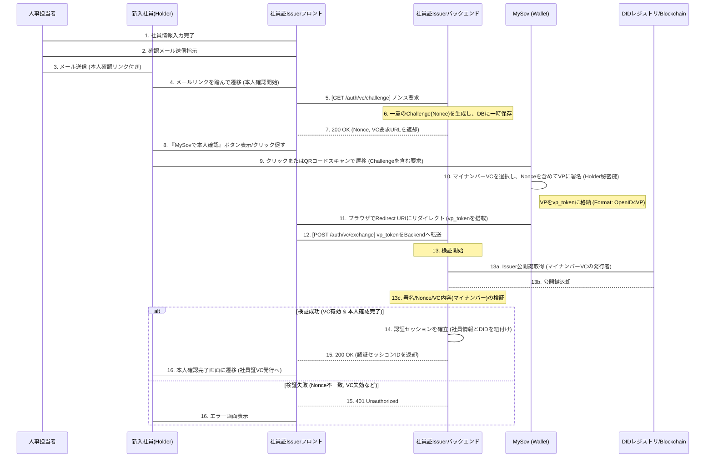

## 人事担当者のVCによるログインとJWT作成フローについて

```mermaid
sequenceDiagram
    participant HR as 人事担当者
    participant IssuerFE as 検証サイト(フロントエンド)
    participant IssuerBE as 検証サイト(バックエンド)
    participant MySov as MySov (Wallet)
    participant VDR as DIDレジストリ/Blockchain

    HR->IssuerFE: 1. ログイン開始
    
    %% VC検証要求 (Challenge Generation)
    IssuerFE->IssuerBE: 2. [POST /challenge/login] ノンス生成
    Note over IssuerBE: 3. 一意のNonceを生成し、サーバーで一時保存 (リプレイ防止)
    IssuerBE-->IssuerFE: 4. 200 OK (Nonce, VP要求URLを返却)
    IssuerFE->MySov: 5. QRコード表示 / VP提示要求 (Nonceと要求クレームを含む)

    %% 署名と提示 (VP Presentation)
    MySov->MySov: 6. 社員証VCを選択し、Nonceを含めてVPに署名 (Holder秘密鍵)
    Note right of MySov: VPをvp_tokenに格納
    MySov->IssuerFE: 7. ブラウザでRedirect URIにリダイレクト (vp_tokenを搭載)
    IssuerFE->IssuerBE: 8. [POST /auth/vc/exchange] vp_tokenをBackendへ転送

    %% 検証とセッション確立 (Verification & Session Grant)
    Note over IssuerBE: 9. VC/VP検証開始
    IssuerBE->VDR: 9a.  Issuer (企業) の公開鍵を取得
    VDR-->IssuerBE: 9b. 公開鍵を返却
    Note over IssuerBE: 9c. 署名/Nonce/VC内容(役職)・失効ステータスを厳格に検証

    alt 検証成功 & 社員権限あり
        IssuerBE->IssuerBE: 10. ユーザーID/ロールをPayloadに持つJWTを生成
        IssuerBE-->IssuerFE: 11. 200 OK (JWT/セッションクッキーを返却)
        IssuerFE->HR: 12. ログイン完了 (セッション確立)
    else 検証失敗 (署名不正, VC失効, ロール不足)
        IssuerBE-->IssuerFE: 11. 401 Unauthorized / 403 Forbidden
        IssuerFE->HR: 12. ログイン失敗画面表示
    end
```

## 社員のVCによる本人確認フロー

```mermaid
sequenceDiagram
    participant HR as 人事担当者
    participant NewHire as 新入社員(Holder)
    participant IssuerFE as 社員証Issuerフロント
    participant IssuerBE as 社員証Issuerバックエンド
    participant MySov as MySov (Wallet)
    participant VDR as DIDレジストリ/Blockchain

    %% 1. 発行開始 (HRからのトリガー)
    HR->IssuerFE: 1. 社員情報入力完了
    IssuerFE->HR: 2. 確認メール送信指示
    HR->NewHire: 3. メール送信 (本人確認リンク付き)
    NewHire->IssuerFE: 4. メールリンクを踏んで遷移 (本人確認開始)

    %% 2. VC検証要求 (Challenge Generation)
    IssuerFE->IssuerBE: 5. [GET /auth/vc/challenge] ノンス要求
    Note over IssuerBE: 6. 一意のChallenge(Nonce)を生成し、DBに一時保存
    IssuerBE-->IssuerFE: 7. 200 OK (Nonce, VC要求URLを返却)
    
    IssuerFE->NewHire: 8. 『MySovで本人確認』ボタン表示/クリック促す
    NewHire->MySov: 9. クリックまたはQRコードスキャンで遷移 (Challengeを含む要求)

    %% 3. 署名と提示 (VP Presentation)
    MySov->MySov: 10. マイナンバーVCを選択し、Nonceを含めてVPに署名 (Holder秘密鍵)
    Note right of MySov: VPをvp_tokenに格納 (Format: OpenID4VP)
    MySov->IssuerFE: 11. ブラウザでRedirect URIにリダイレクト (vp_tokenを搭載)

    %% 4. 検証と認証 (Verification)
    IssuerFE->IssuerBE: 12. [POST /auth/vc/exchange] vp_tokenをBackendへ転送
    
    Note over IssuerBE: 13. 検証開始
    IssuerBE->VDR: 13a. Issuer公開鍵取得 (マイナンバーVCの発行者)
    VDR-->IssuerBE: 13b. 公開鍵返却
    Note over IssuerBE: 13c. 署名/Nonce/VC内容(マイナンバー)の検証

    alt 検証成功 (VC有効 & 本人確認完了)
        IssuerBE->IssuerBE: 14. 認証セッションを確立 (社員情報とDIDを紐付け)
        IssuerBE-->IssuerFE: 15. 200 OK (認証セッションIDを返却)
        IssuerFE->NewHire: 16. 本人確認完了画面に遷移 (社員証VC発行へ)
    else 検証失敗 (Nonce不一致, VC失効など)
        IssuerBE-->IssuerFE: 15. 401 Unauthorized
        IssuerFE->NewHire: 16. エラー画面表示
    end
```

