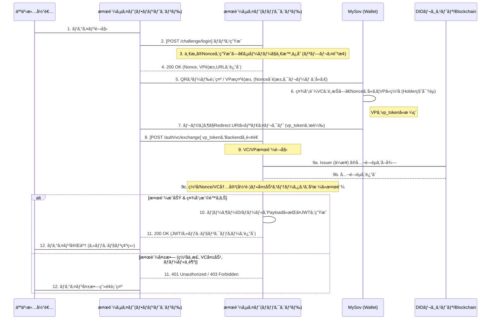
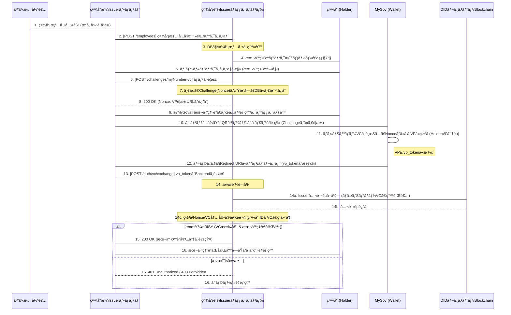

## 人事担当者ã®VCã«ã‚ˆã‚‹ãƒ­ã‚°ã‚¤ãƒ³ã¨JWT作æˆãƒ•ãƒ­ãƒ¼ã«ã¤ã„ã¦

```mermaid
sequenceDiagram
    participant HR as 人事担当者
    participant IssuerFE as 検証サイト(フロントエンド)
    participant IssuerBE as 検証サイト(ãƒãƒƒã‚¯ã‚¨ãƒ³ãƒ‰)
    participant MySov as MySov (Wallet)
    participant VDR as DIDレジストリ/Blockchain

    HR->IssuerFE: 1. ログイン開始
    
    %% VC検証è¦æ±‚ (Challenge Generation)
    IssuerFE->IssuerBE: 2. [POST /challenge/login] ãƒãƒ³ã‚¹ç”Ÿæˆ
    Note over IssuerBE: 3. 一æ„ã®Nonceを生æˆã—ã€ã‚µãƒ¼ãƒãƒ¼ã§ä¸€æ™‚ä¿å­˜ (リプレイ防止)
    IssuerBE-->IssuerFE: 4. 200 OK (Nonce, VPè¦æ±‚URLã‚’è¿”å´)
    IssuerFE->MySov: 5. QRコード表示 / VPæ示è¦æ±‚ (Nonceã¨è¦æ±‚クレームをå«ã‚€)

    %% ç½²åã¨æ示 (VP Presentation)
    MySov->MySov: 6. 社員証VCã‚’é¸æŠã—ã€Nonceã‚’å«ã‚ã¦VPã«ç½²å (Holder秘密éµ)
    Note right of MySov: VPã‚’vp_tokenã«æ ¼ç´
    MySov->IssuerFE: 7. ブラウザã§Redirect URIã«ãƒªãƒ€ã‚¤ãƒ¬ã‚¯ãƒˆ (vp_tokenã‚’æ­è¼‰)
    IssuerFE->IssuerBE: 8. [POST /auth/vc/exchange] vp_tokenã‚’Backendã¸è»¢é€

    %% 検証ã¨ã‚»ãƒƒã‚·ãƒ§ãƒ³ç¢ºç«‹ (Verification & Session Grant)
    Note over IssuerBE: 9. VC/VP検証開始
    IssuerBE->VDR: 9a.  Issuer (ä¼æ¥­) ã®å…¬é–‹éµã‚’å–å¾—
    VDR-->IssuerBE: 9b. 公開éµã‚’è¿”å´
    Note over IssuerBE: 9c. ç½²å/Nonce/VC内容(å½¹è·)・失効ステータスをå³æ ¼ã«æ¤œè¨¼

    alt 検証æˆåŠŸ & 社員権é™ã‚ã‚Š
        IssuerBE->IssuerBE: 10. ユーザーID/ロールをPayloadã«æŒã¤JWTを生æˆ
        IssuerBE-->IssuerFE: 11. 200 OK (JWT/セッションクッキーを返å´)
        IssuerFE->HR: 12. ログイン完了 (セッション確立)
    else 検証失敗 (ç½²åä¸æ­£, VC失効, ロールä¸è¶³)
        IssuerBE-->IssuerFE: 11. 401 Unauthorized / 403 Forbidden
        IssuerFE->HR: 12. ログイン失敗画é¢è¡¨ç¤º
    end
```

## 社員ã®VCã«ã‚ˆã‚‹æœ¬äººç¢ºèªãƒ•ãƒ­ãƒ¼

```mermaid
sequenceDiagram
    participant HR as 人事担当者
    participant IssuerFE as 社員証Issuerフロント
    participant IssuerBE as 社員証Issuerãƒãƒƒã‚¯ã‚¨ãƒ³ãƒ‰
    participant Hire as 社員(Holder)
    participant MySov as MySov (Wallet)
    participant VDR as DIDレジストリ/Blockchain

    %% 1. 情報入力ã¨æ›´æ–° (発行ã®ãƒˆãƒªã‚¬ãƒ¼)
    HR->IssuerFE: 1. 社員情報入力 (æ°å, å½¹è·ãªã©)
    IssuerFE->IssuerBE: 2. [POST /employees] 社員情報ã®ç™»éŒ²ãƒªã‚¯ã‚¨ã‚¹ãƒˆ
    Note over IssuerBE: 3. DBã§ç¤¾å“¡æƒ…報を登録
    IssuerBE->Hire: 4. 本人確èªãƒªãƒ³ã‚¯ä»˜ãメールé€ä¿¡ 📧

    %% 5. VC検証è¦æ±‚ (Challenge Generation)
    Hire->IssuerFE: 5. メールリンクをè¸ã‚“ã§é·ç§» (本人確èªé–‹å§‹)
    IssuerFE->IssuerBE: 6. [POST  /challenges/myNumber-vc] ãƒãƒ³ã‚¹è¦æ±‚
    Note over IssuerBE: 7. 一æ„ã®Challenge(Nonce)を生æˆã—ã€DBã«ä¸€æ™‚ä¿å­˜
    IssuerBE-->IssuerFE: 8. 200 OK (Nonce, VPè¦æ±‚URLã‚’è¿”å´)
    
    IssuerFE->Hire: 9. ã€MySovã§æœ¬äººç¢ºèªã€ãƒœã‚¿ãƒ³è¡¨ç¤º/クリック促ã™
    IssuerFE->MySov: 10. クリックã¾ãŸã¯QRコードスキャンã§é·ç§» (Challengeã‚’å«ã‚€è¦æ±‚)

    %% 6. ç½²åã¨æ示 (VP Presentation)
    MySov->MySov: 11. ãƒã‚¤ãƒŠãƒ³ãƒãƒ¼VCã‚’é¸æŠã—ã€Nonceã‚’å«ã‚ã¦VPã«ç½²å (Holder秘密éµ)
    Note right of MySov: VPã‚’vp_tokenã«æ ¼ç´
    MySov->IssuerFE: 12. ブラウザã§Redirect URIã«ãƒªãƒ€ã‚¤ãƒ¬ã‚¯ãƒˆ (vp_tokenã‚’æ­è¼‰)

    %% 7. 検証ã¨èªè¨¼ (Verification)
    IssuerFE->IssuerBE: 13. [POST /auth/vc/exchange] vp_tokenã‚’Backendã¸è»¢é€
    
    Note over IssuerBE: 14. 検証開始
    IssuerBE->VDR: 14a. Issuer公開éµå–å¾— (ãƒã‚¤ãƒŠãƒ³ãƒãƒ¼VCã®ç™ºè¡Œè€…)
    VDR-->IssuerBE: 14b. 公開éµè¿”å´
    Note over IssuerBE: 14c. ç½²å/Nonce/VC内容ã®æ¤œè¨¼ (社員IDã¨VCã®ç´ä»˜ã‘)

    alt 検証æˆåŠŸ (VC有効 & 本人確èªå®Œäº†)
        IssuerBE->IssuerFE: 15. 200 OK (本人確èªå®Œäº†ã‚’通知)
        IssuerFE->Hire: 16. 本人確èªãŒå®Œäº†ã—ãŸã“ã¨ã‚’ç”»é¢è¡¨ç¤º
    else 検証失敗
        IssuerBE-->IssuerFE: 15. 401 Unauthorized / 403 Forbidden
    IssuerFE->Hire: 16. エラー画é¢è¡¨ç¤º
    end
```

